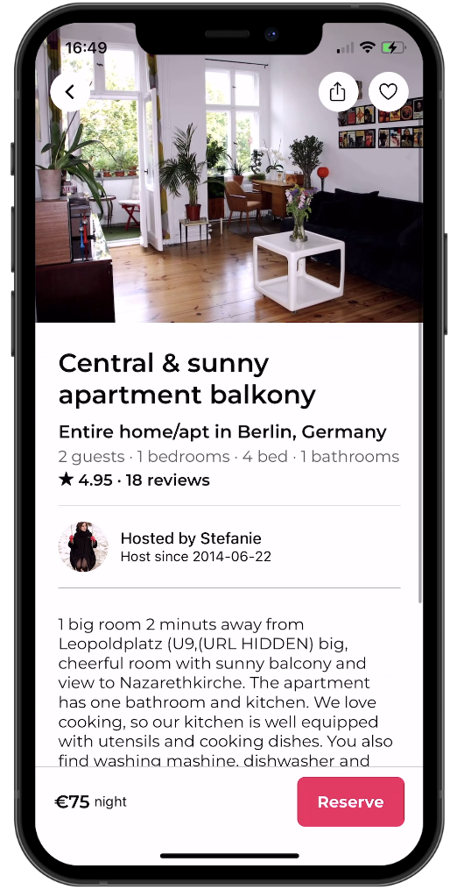

# React Native AirBnB Clone with Clerk

This is a React Native AirBnB clone using [Clerk](https://clerk.com/?utm_source=sponsorship&utm_medium=github&utm_campaign=simong&utm_content=rn-airbnb) for user authentication.

# Imports:

Various React Native components are imported, including View, Text, SafeAreaView, StyleSheet, ScrollView, TouchableOpacity, and icons from @expo/vector-icons and expo-haptics.
# Data:

An array named categories is defined, containing objects with names and corresponding icons. This array is used to generate the category buttons.
Component Definition:

The ExploreHeader component takes a prop named onCategoryChanged, which is a function to be called when a category is selected.
# State and Refs:

The component uses the useState hook to manage the active category index.
Refs (scrollRef and itemsRef) are used to interact with the ScrollView and individual TouchableOpacity elements.
# Functions:

selectCategory: A function that sets the active index, scrolls the ScrollView to the selected category, triggers haptic feedback, and calls the provided onCategoryChanged function.
# Rendering:

The component is wrapped in a SafeAreaView to ensure content does not overlap system elements.
It contains a header with search and filter buttons.
The category buttons are rendered using a horizontal ScrollView. The active category is highlighted with a border at the bottom.
The icons and text for each category are dynamically generated based on the categories array.
# Styles:

Styles are defined using the StyleSheet.create method to ensure better performance.
Styles include the container styles, styles for action row, search button, filter button, category text, and category buttons.

Additional features:

- [Expo Router](https://docs.expo.dev/routing/introduction/) file-based navigation
- [Google](https://clerk.com/docs/authentication/social-connections/google?utm_source=sponsorship&utm_medium=github&utm_campaign=simong&utm_content=rn-airbnb) & [Apple](https://clerk.com/docs/authentication/social-connections/apple?utm_source=sponsorship&utm_medium=github&utm_campaign=simong&utm_content=rn-airbnb) Auth with Clerk
- [Reanimated](https://reanimated-beta-docs.swmansion.com/) 3 for animations
- [MapView](https://docs.expo.dev/versions/latest/sdk/map-view/) with Marker and [Clustering](https://github.com/venits/react-native-map-clustering)
- [Bottom Sheet](https://gorhom.github.io/react-native-bottom-sheet/)
- Modal with Animations and Blurred Background

## Screenshots

## Screnn gif

